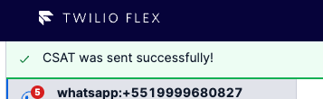

# Plugin Chat CSAT

Twilio Flex Plugins allow you to customize the appearance and behavior of [Twilio Flex](https://www.twilio.com/flex). If you want to learn more about the capabilities and how to use the API, check out our [Flex documentation](https://www.twilio.com/docs/flex).

This Flex Plugin goal is to enable agents to send CSAT surveys using a button in the TaskCanvasHeader for chat tasks. This works similar to Park Interactions, but it creates a webhook to a Studio Flow instead of a webhook to a serverless function that would do the unparking.

**This Plugin is part of a solution that also contains serverless functions to work.** Check details in the following section.

Send CSAT button


Success Notification



Demo (Portuguese)


## Dependencies

The second part of this solution relies on a serverless function that will take care of the instrumentation of the task, agent, and Conversation. It's here where you can change the CSAT first question text.

Check [send-csat-survey.js](./dependencies/send-csat-survey.js) file.

This serverless function has a variable that need to be added to the `.env` of the serverless service

```
CSAT_STUDIO_FLOW_SID=FWxxxxxxxxxx
```

This variable refers to the Studio Flow Sid, where you want to handle CSAT. An example can be seen below.


In this Studio Flow, it's important that you close the Conversation after capturing the answers, otherwise the customer will get stuck in this Studio Flow.

Check [close-conversation.js](./dependencies/close-conversation.js) file for an example function for this case. It receives `conversationSid` as parameter.

For more information about Serverless Services, please check [Twilio Serverless Toolkit](https://www.twilio.com/docs/labs/serverless-toolkit) docs.

## Setup

Make sure you have [Node.js](https://nodejs.org) as well as [`npm`](https://npmjs.com). We support Node >= 10.12 (and recommend the _even_ versions of Node). Afterwards, install the dependencies by running `npm install`:

```bash
cd plugin-chat-csat

# If you use npm
npm install
```

Next, please install the [Twilio CLI](https://www.twilio.com/docs/twilio-cli/quickstart) by running:

```bash
brew tap twilio/brew && brew install twilio
```

Finally, install the [Flex Plugin extension](https://github.com/twilio-labs/plugin-flex/tree/v1-beta) for the Twilio CLI:

```bash
twilio plugins:install @twilio-labs/plugin-flex
```

Create the `.env` file in the root folder

```
FLEX_APP_URL_SEND_CSAT_SURVEY=https://xxx-dev.twil.io/send-csat-survey
```

## Development

Run `twilio flex:plugins --help` to see all the commands we currently support. For further details on Flex Plugins refer to our documentation on the [Twilio Docs](https://www.twilio.com/docs/flex/developer/plugins/cli) page.

## Disclaimer

This software is to be considered "sample code", a Type B Deliverable, and is delivered "as-is" to the user. Twilio bears no responsibility to support the use or implementation of this software.
